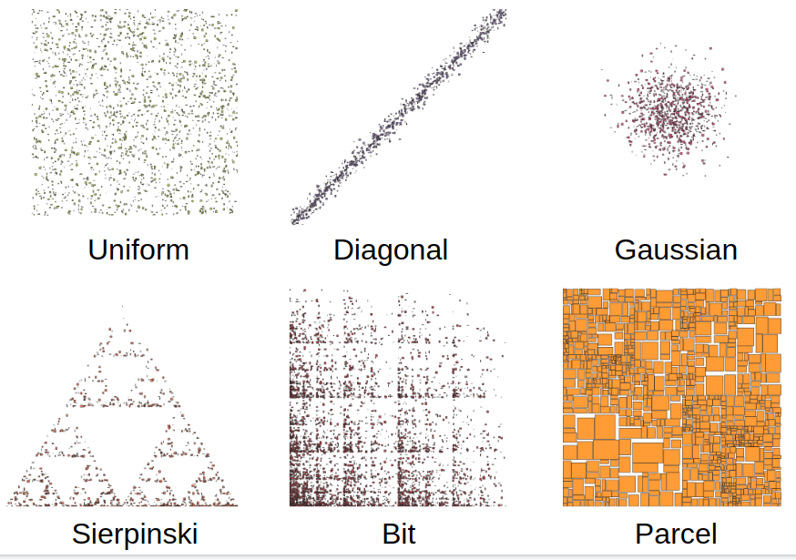

# Spatial Data Generators
This repository provides the implementation for Spatial Data Generators paper, which was presented in 1st ACM SIGSPATIAL International Workshop on Spatial Gems (SpatialGems 2019, https://www.spatialgems.net/). \
This is a Python implementation. You can find a Ruby implementation [here](https://github.com/aseldawy/spatialdatagenerators).

## How to use it?
Show the help for detail information
```
python3 generator.py -h
```

## Demo
Six kinds of supported distribution. Please feel free to contact us if you want to have other spatial distributions.

